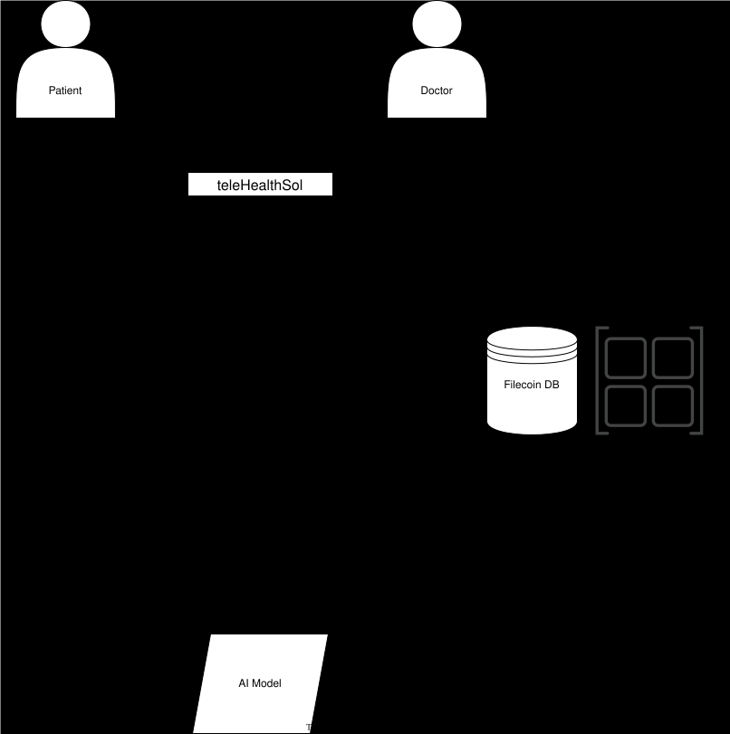

# teleHealthSol

You've reached the official Repo for [teleHealthSol](app.telehealthsol.health "teleHealthSol")

teleHealthSol is an on-chain telemedicine platform that solves 2 major problems:
- Long waiting time at the hospital/unnecessary hosptital visits.
- Missing/lost health records.

Solution
- Reduce waiting time efficiently without affecting the quality of healthcare rendered.
- Keep track of patients' health records using Filecoin.
- Keep patients' health records confidential, leveraging Akave's encryption functionality.




## AI Blueprint Hackathon

We've integrated Filecoin storage using Akave, mainly for;
- Filecoin's off-chain decentralised nature.
- Akave's speed and encryption functionality to keep patients' health records confidential.

The way that we integrated them is as follows;
- Patients' health records - complaints, diagnosis & prescription - are saved on Filecoin, through Akave.
- The CID, patient's wallet address and doctor's wallet address are then saved on Solana.
- The saved records are fetched and used to train the AI model.
- The saved records can be fetched and veiwed by doctors to aid in medical diagnosis and decision making.
- The trained model is uploaded to Filecoin through AKave as well.
- Model is queried through Akave for help with health diagnoses.

The AI-model related files can be found in the backend-ml directory.
The health storage related files can be found in;
- app/app/component/utils/akave-api.js
- app/app/doctor/messages/chatid/page.tsx
- app/app/component/AIAssistantPopup.tsx
- app/app/component/PatientDetailsPopup.tsx
- app/app/component/PredictDiagnosis.tsx

### To test the app

- I recommend signing up as a doctor - as this is where everything goes down
- Login to dashboard
- Paste this link to test the Blueprint Hackathon integration https://app.telehealthsol.health/doctor/messages/AXisVZ9Aus6PVdnCNWSD6oHHMM16SF1Vs49aqtRVPvSy to take you to the chat page.
- To upload and retrieve data, click on patient's profile picture
- Click on the blue AI button to chat with the model

### Tools & Languages

Languages/Tools include;
- Rust
- Anchor
- Python
- Nextjs/Typescript
- Solana web3.js
- Solana Blink

## To run locally:

```bash
git clone https://github.com/sabbCodes/telehealth.git

cd telehealth

# install dependencies
npm install
# or
yarn install
# or
pnpm install

# build the program
anchor build

cd app

# install dependencies
npm install
# or
yarn install
# or
pnpm install

# run locally
npm run dev
# or
yarn dev
# or
pnpm dev
```

Open [http://localhost:3000](http://localhost:3000) with your browser to see the result.

> Please note that this guide assumes you have Rust, Anchor, and Solana CLI installed on your machine.